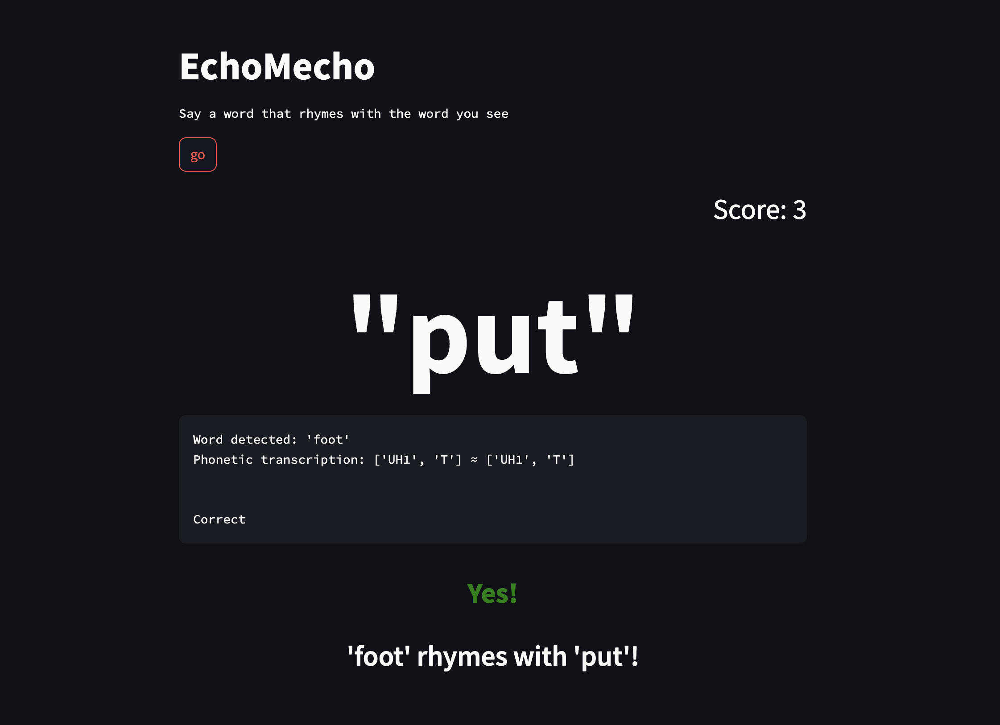

# EchoMecho - Rhyming Game Web App

EchoMecho is a fun and educational web app that challenges users to come up with words that rhyme with a given target word. Built on Python, the app leverages real-time speech-to-text capabilities through AssemblyAI's speech-to-text API. The app also incorporates NLTK (Natural Language Toolkit) for advanced linguistic processing and Streamlit for creating a streamlined user interface.



## Features

- **Real-time Speech-to-Text:** EchoMecho utilizes AssemblyAI's speech-to-text API to convert user speech into text, enabling seamless interaction and gameplay.

- **Rhyming Logic:** The app employs NLTK's linguistic capabilities to get phonentic information and then uses logic to determine whether the user's spoken word rhymes with the target word.

- **User-Friendly Interface:** Built with Streamlit, EchoMecho offers an intuitive and interactive interface

## Installation

To run EchoMecho locally, follow these steps:

1. Clone the repository:

   ```bash
   git clone https://github.com/your-username/EchoMecho.git
   cd EchoMecho
   ```

2. Install the required dependencies:

   ```bash
   pip install -r requirements.txt
   ```

3. Obtain an API key from [AssemblyAI](https://www.assemblyai.com/) and replace `'auth_key'` in the code with your actual API key.

## Usage

1. Run the Streamlit app:

   ```bash
   streamlit run echo.py
   ```

2. The app will open in your default web browser. Follow the on-screen instructions to start playing the EchoMecho rhyming game.

## Dependencies

The following dependencies are used in this project:

- nltk==3.8.1
- PyAudio==0.2.13
- streamlit==1.26.0
- websockets==11.0.3

## Notes

An algorithm to accurately check for rhymes in general — even given the power of NLTK — seems non-trivial. As an alternative approach, I explored using the `pronouncing` library:

```python
import pronouncing

def check_rhyme(word1, word2):
    word1_rhymes = pronouncing.rhymes(word1)

    if word2 in word1_rhymes:
        return f"'{word1}' and '{word2}' rhyme!"
    else:
        return f"'{word1}' and '{word2}' do not rhyme."

pronouncing.phones_for_word('echo')[0]
```

This is faster but doesn't have as much coverage as my logic using NLTK. Other suggestions or ideas welcome.

## Acknowledgments

- AssemblyAI for providing the powerful speech-to-text API that forms the core of EchoMecho's real-time functionality.
- NLTK contributors for developing the Natural Language Toolkit, enabling advanced linguistic analysis.
- Streamlit developers for creating an efficient framework for rapidly building interactive web applications.

Feel free to explore, modify, and expand upon the EchoMecho project. Have fun rhyming!

For questions or inquiries, please contact [brian.rabern@gmail.com](brian.rabern@gmail.com).
